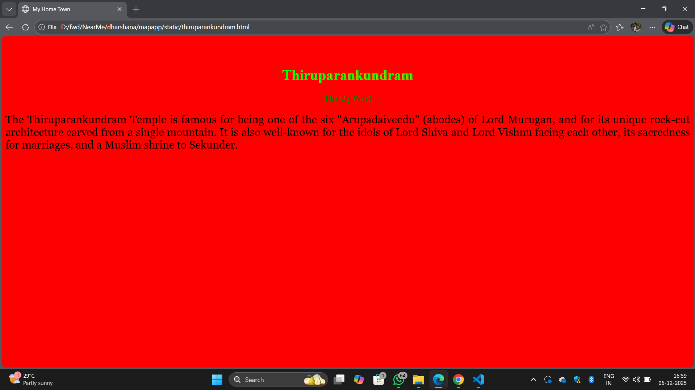
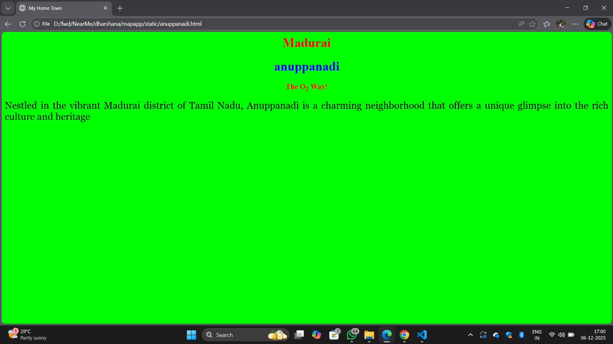
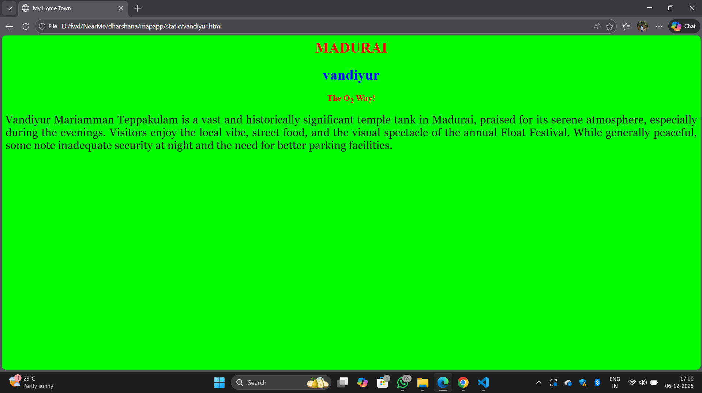
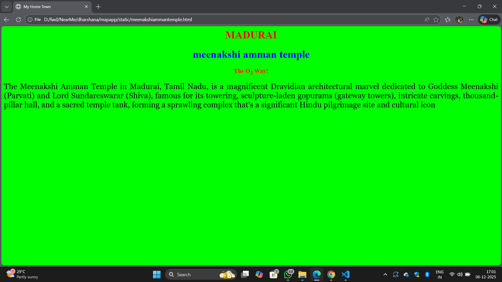
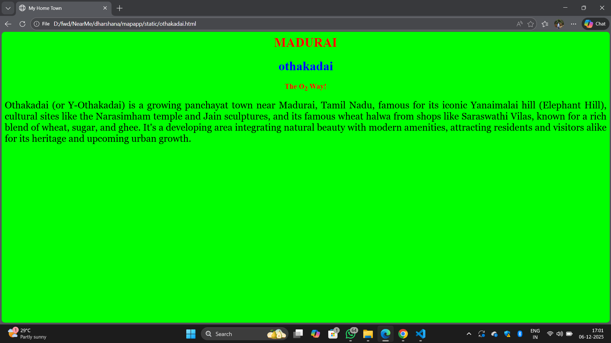

# Ex04 Places Around Me
## Date: 

## AIM
To develop a website to display details about the places around my house.

## DESIGN STEPS

### STEP 1
Create a Django admin interface.

### STEP 2
Download your city map from Google.

### STEP 3
Using ```<map>``` tag name the map.

### STEP 4
Create clickable regions in the image using ```<area>``` tag.

### STEP 5
Write HTML programs for all the regions identified.

### STEP 6
Execute the programs and publish them.

## CODE
```
map.html
<html>
<head>
    <title>My City</title>
</head>

<body>
    <h1 align="center">
        <font color="blue"><b>MADURAI</b></font>
    </h1>

    <h3 align="center">
        <font color="green"><b>Dharshana A (25012420)</b></font>
    </h3>

    <center>
        
        

    <map name="image-map">
        <area target="" alt="thiruparankundram" title="thiruparankundram" href="thiruparankundram.html" coords="520,681,705,769" shape="rec
        <area target="" alt="anuppanadi" title="anuppanadi" href="anuppanadi.html" coords="1048,529,1186,595" shape="rect">
        <area target="" alt="othakadai" title="othakadai" href="othakadai.html" coords="1357,135,1577,237" shape="rect">
        <area target="" alt="vandiyur" title="vandiyur" href="vandiyur.html" coords="1179,416,1292,500" shape="rect">
        <area target="" alt="meenakshi amman temple" title="meenakshi amman temple" href="meenakshiammantemple.html" coords="864,363,969,46
</map>
        
        
    </center>
</body>
</html>
thiruparankundram.html
<html>
<head>
    <title>My Home Town</title>
</head>

<body bgcolor="red">
    <h1 align="center">
        <font color="red"><b>Gingee</b></font>
    </h1>

    <h1 align="center">
        <font color="lime"><b>Thiruparankundram</b></font>
    </h1>

    <h3 align="center">
        <font color="green">
            The O<sub>2</sub> Way!
        </font>
    </h3>

    <p align="justify">
        <font face="Georgia" size="5">
            The Thiruparankundram Temple is famous for being one of the six "Arupadaiveedu" (abodes) of Lord Murugan, and for its unique rock-cut architecture carved from a single mountain. It is also well-known for the idols of Lord Shiva and Lord Vishnu facing each other, its sacredness for marriages, and a Muslim shrine to Sekunder.  
        </font>
    </p>
</body>
</html>
othakadai.html
<html>
<head>
    <title>My Home Town</title>
</head>

<body bgcolor="lime">
    <h1 align="center">
        <font color="red"><b>MADURAI</b></font>
    </h1>

    <h1 align="center">
        <font color="blue"><b>othakadai</b></font>
    </h1>

    <h3 align="center">
        <font color="red">
            The O<sub>2</sub> Way!
        </font>
    </h3>

    <p align="justify">
        <font face="Georgia" size="5">
           Othakadai (or Y-Othakadai) is a growing panchayat town near Madurai, Tamil Nadu, famous for its iconic Yanaimalai hill (Elephant Hill), cultural sites like the Narasimham temple and Jain sculptures, and its famous wheat halwa from shops like Saraswathi Vilas, known for a rich blend of wheat, sugar, and ghee. It's a developing area integrating natural beauty with modern amenities, attracting residents and visitors alike for its heritage and upcoming urban growth. 
           
           
        </font>
    </p>
</body>
</html>
vandiyur.html
<html>
<head>
    <title>My Home Town</title>
</head>

<body bgcolor="lime">
    <h1 align="center">
        <font color="red"><b>MADURAI</b></font>
    </h1>

    <h1 align="center">
        <font color="blue"><b>vandiyur</b></font>
    </h1>

    <h3 align="center">
        <font color="red">
            The O<sub>2</sub> Way!
        </font>
    </h3>

    <p align="justify">
        <font face="Georgia" size="5">
           Vandiyur Mariamman Teppakulam is a vast and historically significant temple tank in Madurai, praised for its serene atmosphere, especially
           
           
        </font>
    </p>
</body>
</html>
anuppanadi.html
<html>
<head>
    <title>My Home Town</title>
</head>

<body bgcolor="lime">
    <h1 align="center">
        <font color="red"><b>Madurai</b></font>
    </h1>

    <h1 align="center">
        <font color="blue"><b>anuppanadi</b></font>
    </h1>

    <h3 align="center">
        <font color="red">
            The O<sub>2</sub> Way!
        </font>
    </h3>

    <p align="justify">
        <font face="Georgia" size="5">
            Nestled in the vibrant Madurai district of Tamil Nadu, Anuppanadi is a charming neighborhood that offers a unique glimpse into the rich culture and heritage 
        </font>
    </p>
</body>
</html>
meenakshiammantemple.html
<html>
<head>
    <title>My Home Town</title>
</head>

<body bgcolor="lime">
    <h1 align="center">
        <font color="red"><b>MADURAI</b></font>
    </h1>

    <h1 align="center">
        <font color="blue"><b>meenakshi amman temple</b></font>
    </h1>

    <h3 align="center">
        <font color="red">
            The O<sub>2</sub> Way!
        </font>
    </h3>

    <p align="justify">
        <font face="Georgia" size="5">
            The Meenakshi Amman Temple in Madurai, Tamil Nadu, is a magnificent Dravidian architectural marvel dedicated to Goddess Meenakshi (Parvati) and Lord Sundareswar
        </font>
    </p>
</body>
</html>
```

## OUTPUT







## RESULT
The program for implementing image maps using HTML is executed successfully.
